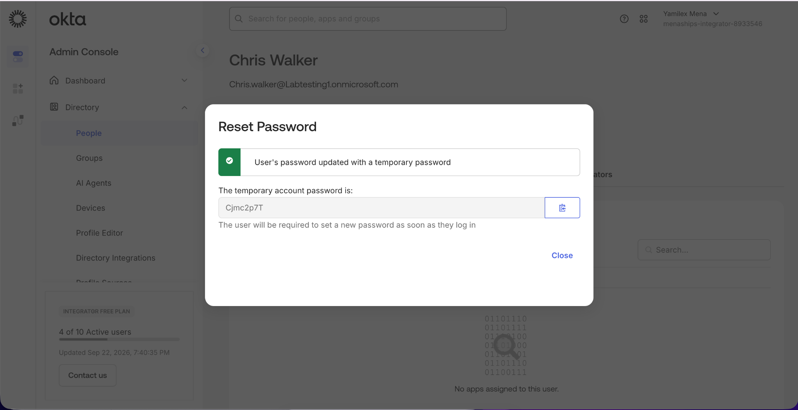
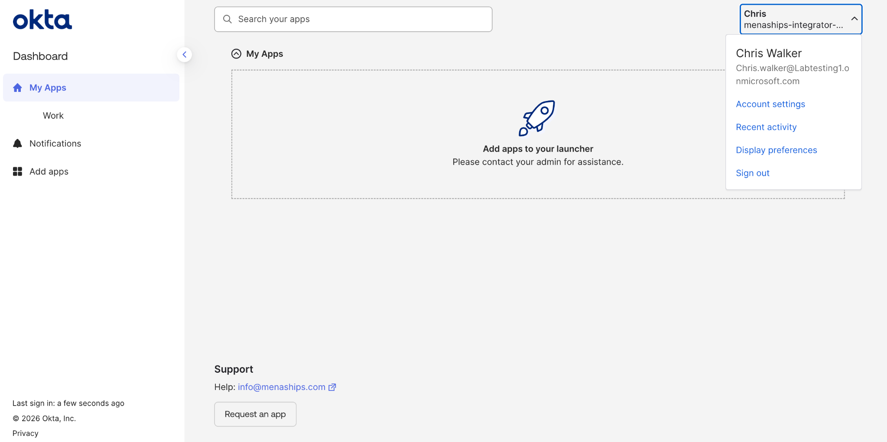
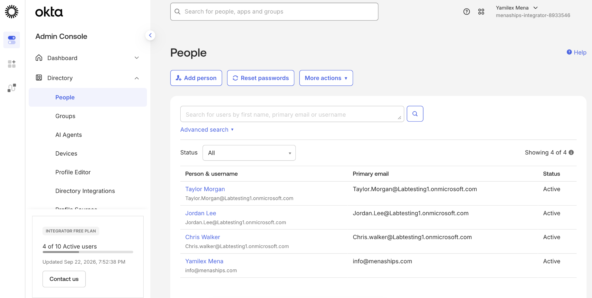

# Enrollment Provisioning in Okta

## Objective

Complete user enrollment and provisioning in Okta by setting a temporary password, verifying successful user sign-in, and confirming that imported accounts are fully active.

## Step 1: Generate a Temporary Password

Generated a temporary password for an imported Okta user. The user is required to create a new password during the first sign-in process.

## Step 2: Verify User Sign-In

Signed in with the provisioned user account and confirmed successful access to the Okta end-user dashboard.

## Step 3: Verify User Activation

Completed the enrollment process for the imported users and verified in the Okta Admin Console that all accounts were active.

## Skills Demonstrated

- Okta Administration
- User Provisioning
- Account Activation
- Temporary Password Management
- User Enrollment
- Identity Lifecycle Management
- Access Verification
